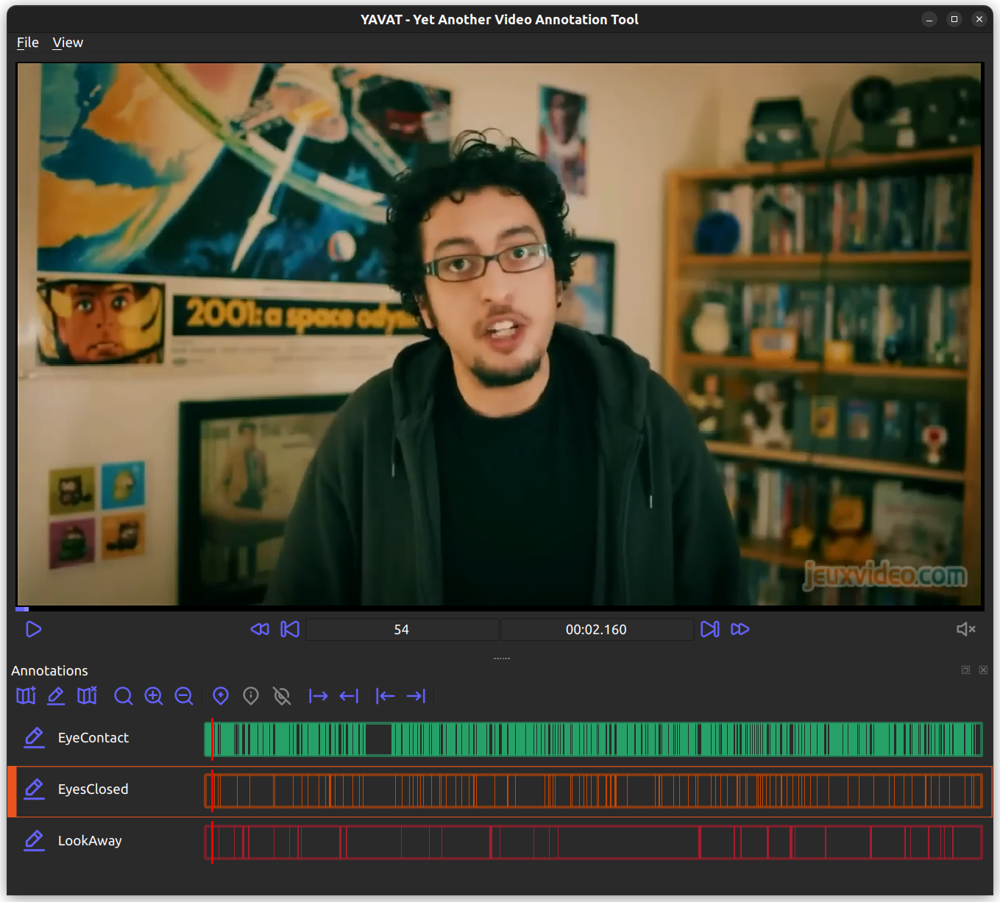

# YAVAT - Yet Another Video Annotation Tool



## Installation

``` shell
pip3 install -r requirements.txt

sudo apt install qtmultimedia libqt5multimedia5-plugins
sudo apt install gstreamer1.0-plugins-good gstreamer1.0-plugins-bad gstreamer1.0-plugins-ugly gstreamer1.0-libav
```

## Starting 

``` shell
python3 test_player.py VIDEO_PATH.EXT
```

## Application Shortcuts

- `Space`:              Play/Pause
- `RightArrow`:         Move Forward 1 second
- `LeftArrow`:          Move Backward 1 second
- `Ctrl+RightArrow`:    Move Forward 1 frame
- `Ctrl+LeftArrow`:     Move Backward 1 frame

