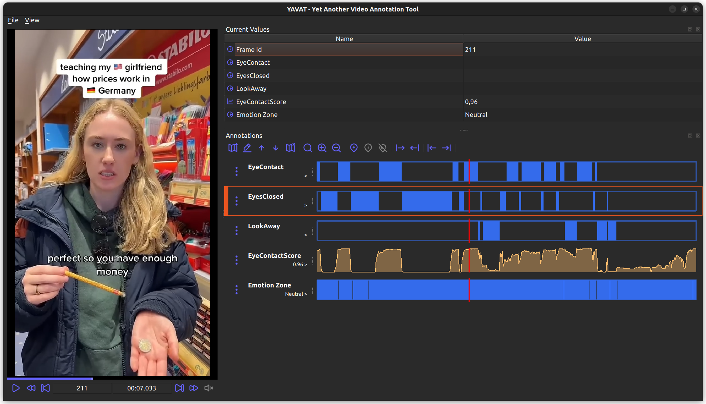

# YAVAT - Yet Another Video Annotation Tool



This project is yet another attempt to propose a video annotation tool.
It focusses on simple time events only; not boxes, segmentation, ... 
At the moment, the application covers `Range Events` and `Ponctual Events`. 
Both can be attached a string label.

Implementation in Python3. It uses PyQt6 and ffmpeg (for video stream information).

## TODO

- Implement annotations Export/Import using JSON.
- Implement better visuals for Events.
- Implement load video/annotation from GUI.

## Installation

``` shell
pip3 install -r requirements.txt

sudo apt install qtmultimedia
sudo apt install gstreamer1.0-plugins-good gstreamer1.0-plugins-bad gstreamer1.0-plugins-ugly gstreamer1.0-libav
```

## Starting 

``` shell
python3 test_player.py VIDEO_PATH.EXT
```

## Application Shortcuts

### Anytime

- `Space`:                  Play/Pause
- `RightArrow`:             Move Forward 1 second
- `LeftArrow`:              Move Backward 1 second
- `Ctrl + RightArrow`:      Move Forward 1 frame
- `Ctrl + LeftArrow`:       Move Backward 1 frame
- `UpArrow`:                Select previous timeline
- `DownArrow`:              Select next timeline
- `M`:                      Mute/Unmute video.

### When a timeline is selected

- `Shift + RightArrow`:     Move to nearest previous event boundary
- `Shift + LeftArrow`:      Move to nearest next event boundary
- `R`:                      Add a new Range Event starting at current time position
- `P`:                      Add a new Ponctual Event at current time position

### When a Range Event is active on the selected timeline

- `Ctrl + Shift + RightArrow`:  Move the right boundary of the event to the current time position.
- `Ctrl + Shift + LeftArrow`:   Move the left boundary of the event to the current time position.
- `Ctrl + R`:                   Convert the current event into a Range Event starting at current time position
- `Ctrl + P`:                   Convert the current event into a Ponctual Event at current time position
