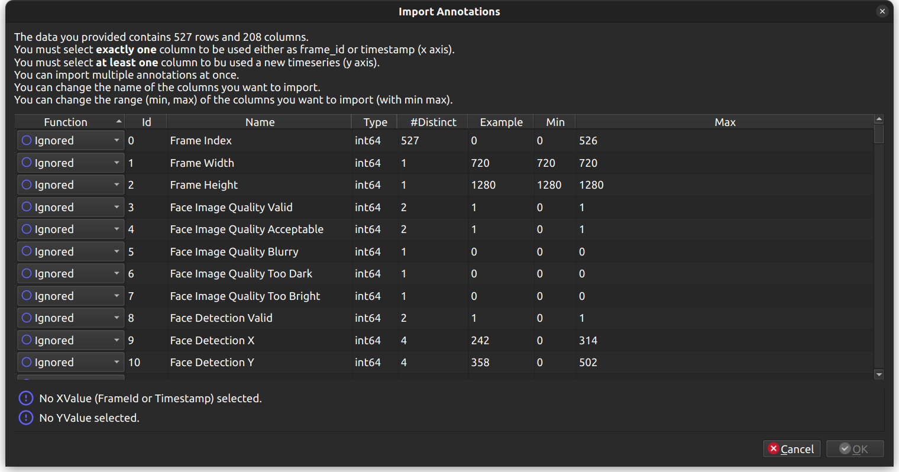

# YAVAT - Yet Another Video Annotation Tool


Yet Another Video Annotation Tool meant to be easy to use. 
Make frame-wise video event annotations fast and easy.

It focusses on simple time events only; not boxes, segmentation, ... 
An event is defined by a start a stop and optionaly a string label.
Start and stop of events can only be on an exact frame timestamp.
An event can be ponctual: one-frame wide. 

It also allows showing timeseries imported from CSV/Excel/Json files.

Implementation in Python3. It uses PyQt6 and ffmpeg.

## Features 

### Version 1.5.0

- Create/Edit/Delete Annotation Timelines.
- Create/Edit/Delete Events on a timeline.
- Move an event to another timeline.
- Edit Event > Label > Annotation color.
- Import One/Multiple Annotations from a CSV/Excel/Json file.
- Move Annotations Up/Down
- Drag Annotation as JSON-Formated text
- Save/Load Annotations in a JSON-based YAVAT File.
- Show named timeseries stored in the annotation file.

### TODO / Suggestions

- Implement Annotation Grid (like in ELAN)

## Getting Started

### Installation 

``` shell
pip3 install -r requirements.txt

sudo apt install qtmultimedia
sudo apt install gstreamer1.0-plugins-good gstreamer1.0-plugins-bad gstreamer1.0-plugins-ugly gstreamer1.0-libav
```

Optionaly you can register the application to access it in the application pannel

``` shell
# register new mime-type
xdg-mime install --novendor --mode user application-x-yavat.xml
update-mime-database ~/.local/share/mime

# register icon for the mime-type & the default 'hicolor' theme
xdg-icon-resource install --context mimetypes --theme hicolor --size 64 assets/icons/yavat.png x-yavat
# if you use another theme, you need ALSO to register for your theme
# you can check what theme you are using with 
gsettings get org.gnome.desktop.interface gtk-theme
# update icons cache
gtk-update-icon-cache --ignore-theme-index ~/.local/share/icons

# register the application
cp yavat.desktop ~/.local/share/applications/
chmod +x ~/.local/share/applications/yavat.desktop
update-desktop-database ~/.local/share/applications
```


### Launching the App

``` shell
usage: yavat.py [-h] [path]

positional arguments:
  path: (optional) path of a video or .yavat file.

options:
  -h, --help  show this help message and exit
```

## Application Shortcuts

UX has been designed to ensure that annotation experience is as fast and pleasant as possible.
Shortcuts are provided to allow keyboard-only annotation.
I use this tool a lot myself.

### Anytime

- `Space`:                  Play/Pause
- `RightArrow`:             Move Forward 1 second
- `LeftArrow`:              Move Backward 1 second
- `Ctrl + RightArrow`:      Move Forward 1 frame
- `Ctrl + LeftArrow`:       Move Backward 1 frame
- `M`:                      Mute/Unmute video.
- `UpArrow`:                Select previous timeline
- `DownArrow`:              Select next timeline
- `Ctrl`:                   Hide event handles (handy to move a ponctual event).
- `Shift + RightArrow`      Goto the neareset event bound before the current position.
- `Shift + LeftArrow`       Goto the neareset event bound after the current position.
- `Ctrl + I`                Open Timeseries Import Dialog.
- `Ctrl + Wheel Up`         Zoom Out
- `Ctrl + Wheel Down`       Zoom In
- `Ctrl + Wheel Left`       Move Left
- `Ctrl + Wheel Right`      Move Right

### When no Event on the selected timeline at the current time position

- `E`:                          Add an Event starting at current time position
- `Ctrl + Shift + RightArrow`:  Move the right boundary of the nearest previous event forward to the current time position.
- `Ctrl + Shift + LeftArrow`:   Move the left boundary of the nearest next event backward to the current time position.

### When a Range Event is active on the selected timeline

- `Delete`:                     Delete the event.
- `Ctrl + Shift + LeftArrow`:   Move the left boundary of the event forward to the current time position.
- `Ctrl + Shift + RightArrow`:  Move the right boundary of the event backward to the current time position.

# Importing Annotations



- Timeseries : You can select any data column with int or float type to be imported as a new Timeseries.
- Timeline Single : You can select any data column with number of distinct y-values <= 10 to be imported as a single new Timeline. Any continuous data chunks are grouped in a single Event. The YValue is used as Event's label.
- Timeline Multi : You can select any data column with number of distinct y-values <= 10 to be imported as multiple Timelines. One timeline is created for each distinct y-value. Timeline's name is "COLUMN_NAME - Y_VALUE". Any continuous data chunks are grouped in a single Event and added to the corresponding named timeline.

# About Event Color Hierarchy

Event color is specified in that order

1. A color is set for this particular event (in event edition dialog).
2. A color is set for this label on this timeline (in event edition dialog).
3. A color is set for the timeline (in the timeline edition dialog).

# Contributing

I welcome contributions from other developers to help me make this application even better.

## Credits

This project is inspired by the tools I used or have tested. 

- [ANVIL](http://www.anvil-software.de/)
- [VIA Annotator](https://www.robots.ox.ac.uk/~vgg/software/via/app/via_video_annotator.html)
- [ELAN](https://archive.mpi.nl/tla/elan)

## License

Copyright (c) 2024 Florent TARALLE, YAVAT is released under the MIT license.
